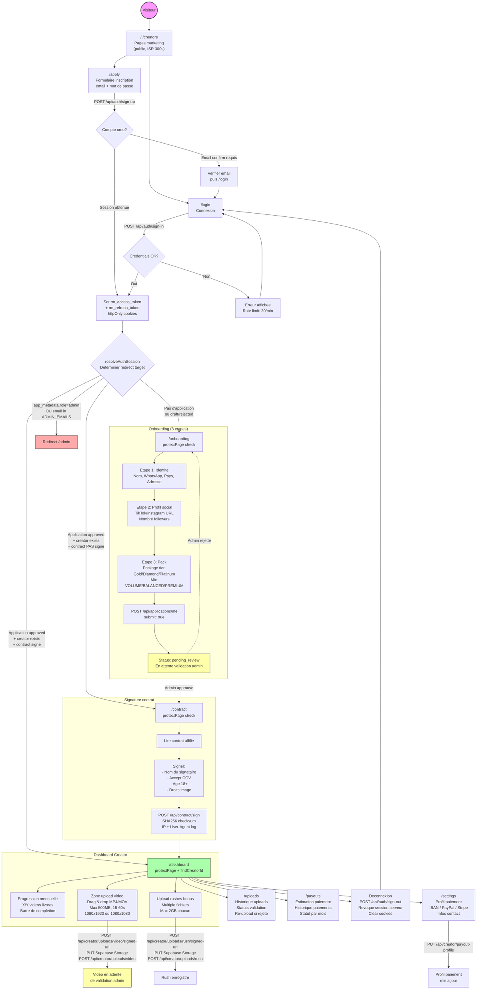
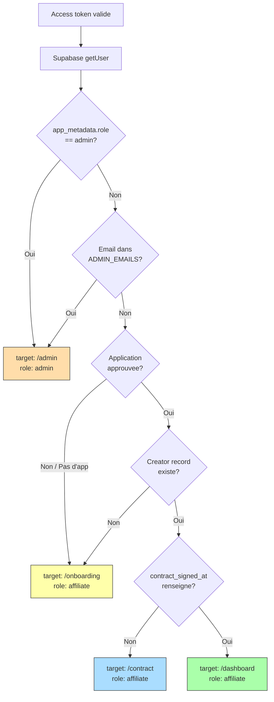

# RetroMuscle - Diagrammes User Flow

## 1. FLOW AFFILIATE (Creator)



---

## 2. FLOW ADMIN

```mermaid
flowchart TD
    ADMIN_START((Admin)) --> LOGIN["/login\nConnexion email + mdp"]
    LOGIN -->|POST /api/auth/sign-in| AUTH{Auth OK?}
    AUTH -->|Non| LOGIN
    AUTH -->|Oui| RESOLVE{resolveAuthSession}
    RESOLVE -->|role=admin| ADMIN_DASH

    subgraph MIDDLEWARE ["Middleware (toutes routes /admin/*)"]
        MW_CHECK[Verifier rm_access_token\nAuto-refresh si < 90s\nRedirect /login si expire]
    end

    RESOLVE --> MIDDLEWARE

    subgraph ADMIN_DASHBOARD ["Dashboard Admin /admin"]
        ADMIN_DASH["/admin\nprotectPage /admin\ngetAdminDashboardData"]
        METRICS[5 Metriques cles:\n- Createurs OK\n- Createurs en attente\n- Videos a valider\n- Paiements a faire\n- Total a payer]
        VALIDATION[File de validation\nTable filtrable:\ncreateur, type, date\nBulk select]
        PAYMENTS[Gestion paiements\nTable avec montants\net statuts]
        CREATORS_TABLE[Createurs\nCollapsible details\nLiens vers fiches]
        TRACKING_TABLE[Tracking mensuel\nCollapsible details\nQuotas vs livres]
    end

    ADMIN_DASH --> METRICS
    ADMIN_DASH --> VALIDATION
    ADMIN_DASH --> PAYMENTS
    ADMIN_DASH --> CREATORS_TABLE
    ADMIN_DASH --> TRACKING_TABLE

    subgraph VIDEO_REVIEW ["Review Videos"]
        PREVIEW[Voir video\nGET /api/videos/preview\nSigned URL Supabase\nOuvre nouvel onglet]
        APPROVE_V[Valider\nPOST /api/admin/videos/review\ndecision: approved]
        REJECT_V[Rejeter\nPOST /api/admin/videos/review\ndecision: rejected\n+ raison obligatoire]
        BULK_APPROVE[Valider en lot\nMultiple videoIds]
        BULK_REJECT[Rejeter en lot\nRaison commune]
    end

    VALIDATION --> PREVIEW
    VALIDATION --> APPROVE_V
    VALIDATION --> REJECT_V
    VALIDATION --> BULK_APPROVE
    VALIDATION --> BULK_REJECT

    APPROVE_V --> AUDIT_LOG[Audit log\nadmin_audit_logs\naction + IP + UA]
    REJECT_V --> AUDIT_LOG
    BULK_APPROVE --> AUDIT_LOG
    BULK_REJECT --> AUDIT_LOG

    subgraph PAYMENT_OPS ["Operations Paiement"]
        MARK_PAID[Marquer paye\nPOST /api/admin/payments/mark-paid\nconfirm dialog\nIrreversible]
        EXPORT_CSV[Export CSV\nGET /api/admin/payments/export\nProtection formules\nFichier .csv telecharge]
    end

    PAYMENTS --> MARK_PAID
    PAYMENTS --> EXPORT_CSV
    MARK_PAID --> AUDIT_LOG

    subgraph APPLICATIONS ["Candidatures /admin/applications"]
        APP_PAGE["/admin/applications\nprotectPage /admin\ngetAdminApplicationsData"]
        APP_LIST[Liste candidatures\nFiltres par statut:\ndraft | pending_review\napproved | rejected]
        APP_DETAIL[Detail candidature\nHandle, nom, email\nWhatsApp, pays\nTikTok/Instagram\nFollowers, pack]
        APP_APPROVE[Approuver\nPOST /api/admin/applications/review\ndecision: approved\nCree le creator record]
        APP_REJECT[Refuser\nPOST /api/admin/applications/review\ndecision: rejected\nNotes visibles par le creator]
    end

    ADMIN_DASH -->|Lien Candidatures| APP_PAGE
    APP_PAGE --> APP_LIST --> APP_DETAIL
    APP_DETAIL --> APP_APPROVE --> AUDIT_LOG
    APP_DETAIL --> APP_REJECT --> AUDIT_LOG

    subgraph CREATOR_DETAIL ["Detail Creator /admin/creators/[id]"]
        DETAIL_PAGE["/admin/creators/:id\nprotectPage /admin\nisUuid validation"]
        PROFILE_SEC[Profil\nNom, email, WhatsApp\nPays, adresse]
        CONTRACT_SEC[Contrat\nDate signature\nHistorique signatures\nIP, version, SHA256]
        PAYOUT_SEC[Paiement\nMethode: IBAN/PayPal/Stripe\nIBAN masque toggle\nTitulaire compte]
        VIDEOS_SEC[Videos du mois\nType, statut, meta\nPreview signed URL\nMax 16 affichees]
        RUSHES_SEC[Rushes du mois\nFichier, taille, date\nPreview si disponible\nMax 12 affiches]
        HISTORY_SEC[Historique trackings\nMois, pack, livrees\nMontant, statut, date paiement]
    end

    CREATORS_TABLE -->|Clic sur handle| DETAIL_PAGE
    TRACKING_TABLE -->|Clic sur handle| DETAIL_PAGE
    DETAIL_PAGE --> PROFILE_SEC
    DETAIL_PAGE --> CONTRACT_SEC
    DETAIL_PAGE --> PAYOUT_SEC
    DETAIL_PAGE --> VIDEOS_SEC
    DETAIL_PAGE --> RUSHES_SEC
    DETAIL_PAGE --> HISTORY_SEC

    ADMIN_DASH --> SIGNOUT[Deconnexion\nPOST /api/auth/sign-out\nRevoque session + clear cookies]
    SIGNOUT --> LOGIN

    style ADMIN_START fill:#f9f,stroke:#333,stroke-width:2px
    style ADMIN_DASH fill:#afa,stroke:#333
    style AUDIT_LOG fill:#ddf,stroke:#333
    style MARK_PAID fill:#faa,stroke:#333
```

---

## 3. GUARDS & SECURITE (les deux flows)

```mermaid
flowchart LR
    REQUEST[Request entrante] --> MW{Middleware}

    MW -->|Route /admin/*\n/dashboard/*\netc.| CHECK_TOKEN{Token valide?}
    MW -->|Route /apply\n/login| CHECK_AUTH{Deja connecte?}

    CHECK_TOKEN -->|Non| REFRESH{Refresh token\ndisponible?}
    REFRESH -->|Oui| AUTO_REFRESH[Auto-refresh\nnouvelle session]
    AUTO_REFRESH --> CHECK_TOKEN
    REFRESH -->|Non| REDIRECT_LOGIN[Redirect /login\nClear cookies]

    CHECK_TOKEN -->|Oui| PAGE_GUARD{protectPage\nRole match?}
    PAGE_GUARD -->|Oui| RENDER[Render page]
    PAGE_GUARD -->|Non| NOT_AUTH[/not-authorized]

    CHECK_AUTH -->|Oui| REDIRECT_TARGET[Redirect vers\ntarget resolu]
    CHECK_AUTH -->|Non| RENDER_AUTH[Render login/apply]

    subgraph API_GUARDS ["API Guards"]
        API_REQ[API Request] --> ORIGIN{isAllowedOrigin?}
        ORIGIN -->|Non| ERR_403[403 INVALID_ORIGIN]
        ORIGIN -->|Oui| RATE{Rate limit OK?}
        RATE -->|Non| ERR_429[429 TOO_MANY_REQUESTS]
        RATE -->|Oui| API_AUTH{requireApiRole}
        API_AUTH -->|Token expire| API_REFRESH[Auto-refresh\n+ set new cookies]
        API_REFRESH --> API_AUTH
        API_AUTH -->|Role OK| EXECUTE[Execute use case]
        API_AUTH -->|Role NOK| ERR_401_403[401/403]
    end
```

---

## 4. RESOLUTION REDIRECT TARGET



---

## 5. ISSUES IDENTIFIES

### Flow Affiliate
| # | Issue | Severite | Detail |
|---|-------|----------|--------|
| 1 | **Pas de persistence onboarding** | MEDIUM | Les donnees du formulaire 3 etapes ne sont pas sauvegardees en localStorage -- perte si refresh |
| 2 | **Email confirmation UX floue** | LOW | Message affiche mais pas de lien "renvoyer", flow de verification pas clair |
| 3 | **Rejet application** | LOW | Pas de CTA "re-postuler" explicite, le creator doit deviner qu'il peut re-editer |
| 4 | **Payout profile pas enforce** | MEDIUM | Le creator peut acceder au dashboard sans avoir configure son moyen de paiement |
| 5 | **Creator provisioning** | LOW | Si app approved mais creator record pas cree (race condition), user coince en /onboarding |

### Flow Admin
| # | Issue | Severite | Detail |
|---|-------|----------|--------|
| 1 | **Mark paid irreversible** | MEDIUM | Pas de moyen d'annuler un paiement marque par erreur, seulement confirm() navigateur |
| 2 | **Bulk reject non-transactionnel** | MEDIUM | Si echec au milieu du lot, certaines videos rejetees et d'autres non |
| 3 | **CSV export PII en clair** | HIGH | IBAN et emails exportes sans chiffrement -- risque si fichier intercepte |
| 4 | **Rate limit par endpoint, pas par admin** | LOW | Un token compromis peut faire 120 req/min sur chaque endpoint |
| 5 | **Videos/rushes limites** | LOW | Detail creator montre max 16 videos et 12 rushes -- historique tronque |
| 6 | **Pas de gestion admin UI** | LOW | ADMIN_EMAILS uniquement via env var, pas d'interface pour ajouter/retirer admins |
